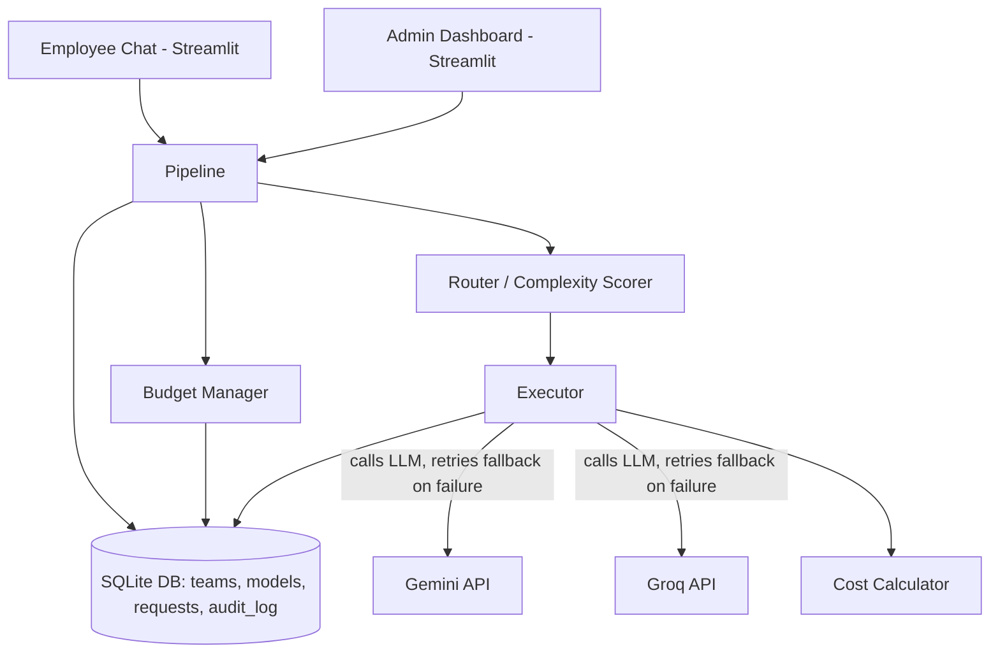

# Prudonomics

**An intelligent framework for cost-optimal LLM selection and organizational AI budget governance.**

## Problem

Organizations are increasingly giving employees unrestricted access to LLM APIs with no cost oversight or model-selection intelligence — every request, simple or complex, often defaults to the most expensive available model. This has led to real-world cases of companies incurring massive, unmonitored AI spend in a single month due to lack of usage governance.

Prudonomics solves this by automatically routing each request to the most cost-appropriate model based on task complexity, enforcing team-level budgets in real time, and providing full explainability into every routing decision.

## What it does

- **Smart routing:** Scores incoming prompts by complexity (length, reasoning signals, code indicators, question structure) and routes to a cheap or premium-tier model accordingly
- **Real cost tracking:** Calculates exact per-request cost from real token usage and current provider pricing
- **Budget enforcement:** Tracks spend per team and enforces soft alerts (80% threshold) and hard blocks (over budget) — blocked requests never reach the LLM, so they cost nothing
- **Explainability / audit trail:** Every routing decision is logged with human-readable reasoning — no black-box behavior
- **Graceful failure handling:** Automatic fallback to a secondary model if the primary fails, proven against real, unplanned API failures during development (not staged)
- **Two-persona dashboard:** An employee-facing chat interface, and a separate admin dashboard for cost governance and oversight

## Architecture




## Tech Stack

- **Backend:** FastAPI, Python
- **LLM Providers:** Google Gemini, Groq (2 providers × 2 tiers = 4 models)
- **Database:** SQLite
- **Dashboard:** Streamlit (multi-page: employee chat + admin governance view)
- **Routing logic:** Heuristic complexity scoring (no ML training — fully transparent and explainable by design)

## Benchmark Results

Measured on a fixed set of 10 prompts (5 simple/factual, 5 complex/reasoning), comparing:
- **Baseline:** every prompt sent to a single premium-tier model (no routing)
- **Prudonomics:** routed automatically between cheap and premium tiers based on complexity

| Metric | Value |
|---|---|
| Prompts benchmarked | 10 (paired comparison — same 10 prompts, both runs succeeded) |
| Baseline total cost | $0.00190485 |
| Prudonomics routed cost | $0.00180127 |
| **Cost reduction** | **5.44%** |
| Failures | 0 in either run |

**Note on this result:** The baseline used Groq's premium model, since Gemini's free-tier premium model hit a daily quota limit during testing. Groq's premium-vs-cheap pricing gap is relatively small (~2x), which makes this a conservative estimate — the gap between commercial provider tiers (e.g., GPT-5 vs. a lightweight model) is typically much larger, so a production deployment routing across paid, higher-tier commercial models would likely show a substantially larger cost reduction. Full raw results are in `data/benchmark_results.json`.

## Real Failures Handled (Not Staged)

During development, the fallback mechanism caught two genuine, unplanned failures:
1. A Gemini model returning a 404 (incorrect/deprecated model access)
2. A Gemini free-tier quota exhaustion (429 error)

Both times, the system automatically fell back to Groq and completed the request successfully. A controlled, repeatable version of this is available in `backend/demo_failure_handling.py`.

## Running Locally

```bash
# Backend
cd backend
uvicorn main:app --reload

# Dashboard (separate terminal)
streamlit run dashboard/app.py
```

Requires a `.env` file with `GOOGLE_API_KEY` and `GROQ_API_KEY` (see `.env` structure in repo — keys are never committed).

## Project Structure

- **`backend/`** — FastAPI app, routing, execution, providers
- **`dashboard/`** — Streamlit employee + admin apps
- **`db/`** — SQLite schema, seed scripts
- **`data/`** — Benchmark prompts and results
- **`README.md`**